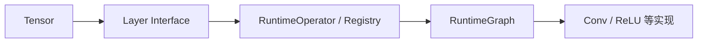

> **学习信息**
> **学习日期：** 2026-09-07（周一）至 2026-09-08（周二）
> **重点：** 按对象关系阅读真实工程，而不是逐文件漫游
> **所属计划：** 14 天 C++ 学习计划 · Day 13
> **关联课程：** 自制深度学习推理框架/第2课 张量的设计、自制深度学习推理框架/第5课 算子和算子注册器的设计与实现


<!-- more -->
## 今日目标

- [x] 按 Tensor → Layer → Operator → Runtime → Conv 的顺序阅读。
- [x] 对每个 Type 回答职责、所有权、数据流和 C++ 机制。
- [x] 识别 Template、Virtual、Registry、smart pointer 与 move。
- [x] 拆解真实函数参数中的嵌套类型。

## 1. 为什么不从仓库入口乱读

真实项目文件多、依赖多。若逐目录扫描，容易只记住文件名而不知道对象如何协作。先按类型职责建立阅读顺序：



这张图表示阅读路线，不是调用方向。运行时通常由 `RuntimeGraph` 调度 `RuntimeOperator`，再调用具体 `Layer` 读写 `Tensor`。

每个模块只回答四个问题：

1. 这个 Type 负责什么？
2. 谁拥有它？
3. 数据如何传入、保存、输出？
4. 它体现了哪些 C++ 机制？

## 2. Tensor：数据与 Const Interface

Tensor 是数值数据、shape 与访问接口的封装。阅读时重点识别：

```text
Template / 元素类型
Container / 连续数据
const member function
T& 与 const T& overload
```

这与 Day 3、4、6 直接对应：Container 保存数据，Class 提供边界清晰的接口，Template 泛化元素类型。

## 3. Layer：统一算子接口

```cpp
class Layer {
public:
    virtual InferStatus Forward(...) = 0;
    virtual ~Layer() = default;
};
```

它把“怎样执行算子”抽象成统一接口。Conv、ReLU、Pooling 等派生类通过 override 提供不同实现。

```text
Base Interface
  ↓ virtual dispatch
Concrete Layer::Forward
```

这里回收 Day 5 的 Abstract Class、Polymorphism 与 Virtual Destructor。

## 4. RuntimeOperator 与 Registry

RuntimeOperator 保存节点名称、类型、输入输出 Operand、参数与对应 Layer。Registry 根据 type 字符串找到 Creator，创建正确的 Layer：

```text
"nn.Conv2d"
   ↓
Registry
   ↓
Creator
   ↓
ConvolutionLayer
```

这就是 Day 7 unordered_map 思想与 Day 5 Factory/Polymorphism 的工程落点。

## 5. Ownership 与复杂参数

```cpp
const std::shared_ptr<Tensor<float>>& input
```

从内向外读：

```text
float → Tensor<float> → shared_ptr<Tensor<float>>
      → const reference to shared_ptr
```

它避免复制 shared_ptr 句柄，但并不让 Tensor 自动变成 const。若要只读 Tensor，应是 shared_ptr<const Tensor<float>> 或经 const 接口访问。

典型关系：

```text
RuntimeGraph
  └─ shared_ptr → RuntimeOperator
                     └─ shared_ptr → Layer
Layer ─ weak_ptr ───────→ RuntimeOperator
```

weak_ptr 回指表示“访问上下文”而不是“拥有上下文”，因此可避免 shared ownership cycle。

## 6. Conv：抽象最终落到数值代码

卷积 Layer 将输入 Tensor、权重、padding、stride 和 group 组合为前向计算；它用 Im2Col + GEMM 把滑动窗口计算转换为矩阵乘法。

```text
Tensor input
  ↓ Im2Col
matrix
  ↓ GEMM with weight
Tensor output
```

这证明 C++ 语言机制不是独立知识点：Template、RAII、Vector、Virtual、smart pointer 都是数值算子能被可靠组织与执行的基础。

## 7. 阅读结论

| 类型 | 主要职责 | 关键 C++ 机制 |
| --- | --- | --- |
| Tensor | 数据和 shape | Template、Container、Const |
| Layer | 算子统一接口 | Abstract Class、Virtual |
| RuntimeOperator | 节点上下文 | shared_ptr、map/vector |
| Registry | 类型到 Creator | unordered_map / Factory |
| RuntimeGraph | 构图与调度 | Ownership、拓扑顺序 |

> **Day 13 完成**
> 已形成按对象关系追踪的源码阅读方法。后续阅读新框架时继续沿“职责、所有权、数据流、机制”四问法推进。

## 后续问题

- [ ] 在主仓库中追踪一次从模型文件读取到 Layer 创建的完整调用栈。
- [ ] 比较课程版本与主仓库在 Tensor Ownership 上的差异。
- [ ] 为一个新 Layer 写从注册到 Forward 的最小补丁。

## 下一步

> C++ Day 14 - MiniInfer & Final Review：用一个最小工程回收所有关键机制。

## 延伸阅读

本篇聚焦阅读路径、对象职责与所有权关系；具体实现细节可结合既有 KuiperInfer 系列阅读：

- [第 1 课：深度学习推理框架基础](/posts/6a42c494/)
- [第 2 课：张量（Tensor）的设计](/posts/78f76b7a/)
- [第 3 课：计算图的设计](/posts/c04b0c1f/)
- [第 4 课：计算图的构建](/posts/5d9c34a6/)
- [第 5 课：算子和算子注册器的设计与实现](/posts/e52053c3/)
