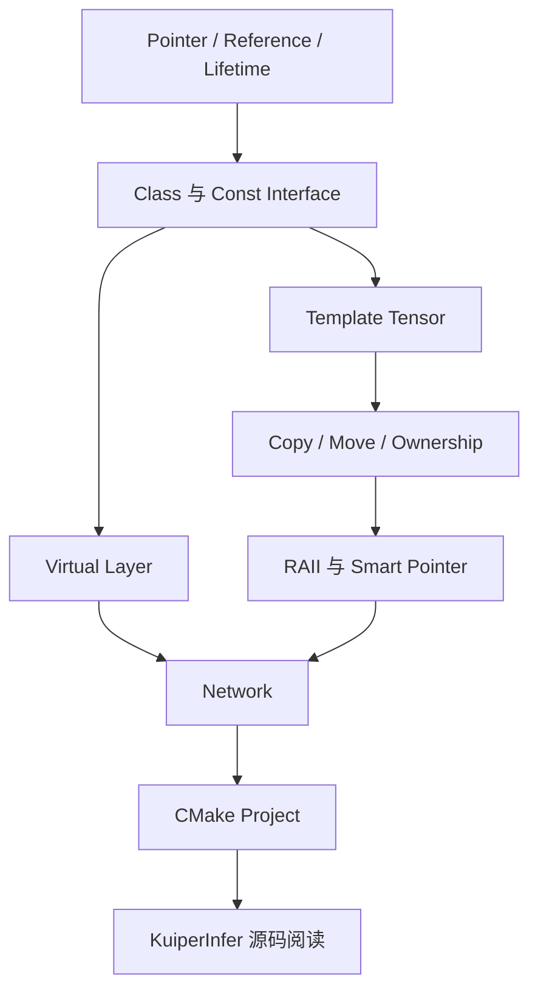

> **学习信息**
> **学习日期：** 2026-09-09（周三）
> **重点：** MiniInfer 设计、知识回收、最终测试、工程驱动学习入口
> **所属计划：** 14 天 C++ 学习计划 · Day 14
> **前置笔记：** C++ Day 13 - KuiperInfer Source Reading


> 图源：Stanford CS106L Spring 2026，[RAII & Smart Pointers Slides](https://web.stanford.edu/class/cs106l/lectures/2026Spring-16-RAII-SmartPointers.pdf) 第 98 页。这三个主题正好连接 MiniInfer 的资源管理与构建实践。


<!-- more -->
## 今日目标

- [x] 用最小推理网络串联 Template、Polymorphism、RAII 与 Move。
- [x] 能解释 Network 对 Layer 的唯一所有权。
- [x] 能设计最小多文件 CMake 项目结构。
- [x] 完成 14 天综合复盘与毕业测试。

## 1. MiniInfer 的最小边界

MiniInfer 不是 TensorRT 的复刻，而是一个约 100～300 行的概念验证项目：

```text
Tensor<T>
  ↓
Layer abstract interface
  ↓
ReLU derived layer
  ↓
Network owns layers
  ↓
forward(input)
```

它的价值是把 14 天概念变成一个相互依赖的工程，而不是再做一套孤立选择题。

## 2. 项目结构

```text
MiniInfer/
├── CMakeLists.txt
├── include/
│   ├── tensor.hpp
│   ├── layer.hpp
│   └── network.hpp
├── src/
│   └── network.cpp
└── main.cpp
```

Template 的 Tensor 定义放在 header；非模板 Network 实现可放在 cpp。

## 3. Tensor<T>

```cpp
template <typename T>
class Tensor {
public:
    explicit Tensor(std::size_t size)
        : data_(size) {}

    std::size_t size() const {
        return data_.size();
    }

    T& operator[](std::size_t i) {
        return data_[i];
    }

    const T& operator[](std::size_t i) const {
        return data_[i];
    }

private:
    std::vector<T> data_;
};
```

它回收了：

```text
Template + vector + const overload + reference return
```

## 4. Layer 与 ReLU

```cpp
class Layer {
public:
    virtual void forward(Tensor<float>& input) = 0;
    virtual ~Layer() = default;
};

class ReLU : public Layer {
public:
    void forward(Tensor<float>& input) override {
        for (std::size_t i = 0; i < input.size(); ++i) {
            if (input[i] < 0) {
                input[i] = 0;
            }
        }
    }
};
```

这里回收：

```text
Abstract Class + virtual + override + polymorphism + virtual destructor
```

## 5. Network 的 Ownership

```cpp
class Network {
public:
    void add(std::unique_ptr<Layer> layer) {
        layers_.push_back(std::move(layer));
    }

    void forward(Tensor<float>& input) {
        for (auto& layer : layers_) {
            layer->forward(input);
        }
    }

private:
    std::vector<std::unique_ptr<Layer>> layers_;
};
```

从内向外读：

```text
Layer
  ↓
unique_ptr<Layer>
  ↓
vector<unique_ptr<Layer>>
  ↓
Network::layers_
```

它表示 Network 独占所有 Layer。`add()` 按值接收 `unique_ptr`，再通过 `std::move` 将 Ownership 转入 `vector`。

```cpp
Network net;
net.add(std::make_unique<ReLU>());
```

离开 Network 作用域时，vector、unique_ptr、Layer 会依次析构，形成 RAII 的完整链条。

## 6. 14 天知识回收图



| 模块 | 在 MiniInfer 的落点 |
| --- | --- |
| Pointer / Reference | Forward 的输入引用 |
| Container | Tensor data_、layers_ |
| Template | Tensor<T> |
| Polymorphism | Layer 与 ReLU |
| Move | add 中转移 unique_ptr |
| RAII | vector 和 unique_ptr 自动析构 |
| CMake | 多文件构建 |

## 7. 最终测试与能力结论

| 测试 | 结果 | 说明 |
| --- | --- | --- |
| 基础阶段测试 | 29 / 30 | 唯一错误是 Reference 重新绑定判断 |
| Day 14 综合选择题 | 35 / 35 | 覆盖 Pointer、STL、Copy/Move、RAII、CMake、MiniInfer |

已经通过第一轮核心 Modern C++：

```text
Pointer / Reference / const / Lifetime
vector / Iterator / Algorithm / Lambda
Class / Template / Polymorphism
Copy / Move / RAII / Smart Pointer
CMake 基础与工程阅读
```

> **工程验证边界**
> 对话记录完整证明了概念、设计和综合测试完成；MiniInfer 的独立多文件构建与主仓库源码深读应作为下一阶段持续实践，而不是仅靠选择题宣布结束。

## 8. 最终反思

三个最重要的认知升级：

1. Move 不是搬内存；它让资源所有权可以转移。
2. RAII 不等于智能指针；智能指针只是 RAII 管理资源的一种形式。
3. 多态不只减少重复代码；它让执行器与具体 Layer 解耦，并允许框架扩展。

> **14 天完成**
> 现在适合停止系统刷基础课，转为 MiniInfer、KuiperInfer、OpenCV、ONNX、TensorRT 与 CUDA 的项目驱动学习；遇到具体 C++ 问题再回查对应知识点。

## 后续路线

1. 独立构建 MiniInfer，并用 CMake 管理。
2. 在 KuiperInfer 中追踪 Tensor → Layer → Runtime → Conv。
3. 用 OpenCV 完成图像预处理与推理输入。
4. 继续 PyTorch → ONNX → TensorRT → CUDA。
